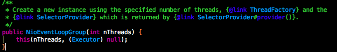

# netty源码分析

我们先看一个server的启动示例：

```
public class MyServer {

    public static void main(String[] args) {
        EventLoopGroup bossGroup = new NioEventLoopGroup();
        EventLoopGroup workerGroup = new NioEventLoopGroup();

        ServerBootstrap bootstrap = new ServerBootstrap();

        bootstrap.group(bossGroup,workerGroup).channel(NioServerSocketChannel.class).childHandler(new MyServerInitializer());

        try {
            ChannelFuture channelFuture = bootstrap.bind(8899).sync();
            channelFuture.channel().closeFuture().sync();
        } catch (InterruptedException e) {
            e.printStackTrace();
        }finally {
            bossGroup.shutdownGracefully();
            workerGroup.shutdownGracefully();
        }
    }
}
```

这段程序是我们使用netty的模板，先创建bossGroup和workerGroup两个EventLoopGroup(事件循环组)，然后创建ServerBootstrap启动器，再向ServerBootstrap设置我们的bossGroup和workerGroup，以及我们使用的Channel类型(本例中使用NioServerSocketChannel)，还有workGroup使用的handler(通过childHandler注册我们定义的Initializer)，最后我们将启动器班内绑定到固定的端口上，然后在finally优雅关闭线程组。

以上是我们使用netty的基本流程，下面我们分析下EventLoopGroup。

## EventLoopGroup

什么是EventLoopGroup呢？看下EventLoopGroup的javadoc
```
Special EventExecutorGroup which allows registering Channels that get processed for later selection during the event loop.
```

翻译过来的意思就是：EventLoopGroup是特殊的EventExecutorGroup，它允许注册多个通道，这些通道会在事件循环期间得到后续的selection操作的处理。

这里的selection操作指的是NIO中的Selector的select操作。

EventExecutorGroup除了包含父类的方法外，它还包含额外的四个方法：

### 1. EventLoop next()
EventExecutorGroup见名知意，它是事件循环组，那么它肯定包含多个事件循环(EventLoop)。next方法返回下一个要使用的事件循环(EventLoop)

### 2. ChannelFuture register(Channel channel);
向事件循环(EventLoop)注册一个通道。返回一个ChannelFuture对象，当注册完成时会ChannelFuture将会得到一个通知。

### 3. ChannelFuture register(ChannelPromise promise);
使用一个ChannelFuture向事件循环(EventLoop)注册一个通道。这里的ChannelFuture指的是ChannelPromise promise，这是由于ChannelPromise实现了ChannelFuture接口。当注册完成时，传递的ChannelFuture对象(即ChannelPromise promise)得到通知，并且得到返回值。

### 4. ChannelFuture register(Channel channel, ChannelPromise promise);
这个方法已经被netty标为过时，netty建议使用第3个方法，在此不再赘述。

## EventExecutorGroup

下面看介绍一下EventLoopGroup的父接口EventExecutorGroup

EventExecutorGroup负责通过它的next()方法来提供io.netty.util.concurrent.EventExecutor。除此之外，它还负责处理它们的生命周期并且允许以全局的方式来关闭它们。

我们发现EventExecutorGroup这里也有next()方法，所以EventLoopGroup的next()方式是重写了EventExecutorGroup的方法，那么说明EventLoop是EventExecutor的子接口，后面我们在研究。


## NioEventLoopGroup

NioEventLoopGroup是 MultithreadEventLoopGroup 的子类。MultithreadEventLoopGroup实现被用于基于Channel的NIO Selector。这里用到了nio的知识。

NioEventLoopGroup默认的构造方式的javadoc：
```
Create a new instance using the default number of threads, the default ThreadFactory and the SelectorProvider which is returned by SelectorProvider.provider().
```
翻译一下：使用默认的线程数量、默认的ThreadFactory以及SelectorProvider.provider()提供的SelectorProvider 来创建一个新的实例，

SelectorProvider.provider()这个方法默认返回的SelectorProvider的实例是与平台相关的，在openjdk中可以看到在linux上返回的是EPollSelectorProvider，windows上返回的WindowsSelectorProvider，mac上返回的是KQueueSelectorProvider，salaris返回的是DevPollSelectorProvider。

下面看一下NioEventLoopGroup构造过程：
这是默认的构造方法，它传递的nThreads即线程数为0


看默认构造方法的重载方法，即默认构造方法调用的另一个构造方法：



线程数出入的是0，Executor是null，在看下另一个重载的构造方法：


线程数传入的是0，Executor是null，SelectorProvider传入的SelectorProvider.provider()提供的SelectorProvider实例，继续看：


线程数传入的是0，Executor是null，SelectorProvider传入的SelectorProvider.provider()提供的SelectorProvider实例，SelectStrategyFactory传入的是DefaultSelectStrategyFactory(即使用默认的选择策略，后面在探讨)，继续看：


这里调用的是父类(MultithreadEventLoopGroup)的构造方法，线程数是0，Executor是null，SelectorProvider传入的SelectorProvider.provider()提供的SelectorProvider实例，SelectStrategyFactory传入的是DefaultSelectStrategyFactory，RejectedExecutionHandler传入的是io.netty.util.concurrent.RejectedExecutionHandler的实例(拒绝策略是抛出RejectedExecutionException)，下面看下父类(MultithreadEventLoopGroup)的构造方法：


可以看到到传入的线程数为0时，线程数被改为io.netty.channel.MultithreadEventLoopGroup#DEFAULT_EVENT_LOOP_THREADS，这个是个静态常量，在MultithreadEventLoopGroup的静态代码块中初始化的：


当系统变量中存在io.netty.eventLoopThreads的值时，使用这个值作为线程数，当不存在时，设置为NettyRuntime.availableProcessors() * 2，这里是机器CPU核心数的2倍，最后调用Runtime.getRuntime().availableProcessors()来获取核心数，调用过程不在赘述。下面我们看MultithreadEventLoopGroup的父类(MultithreadEventExecutorGroup)的构造方法：


构造方法主要做了一下几件是：
1. 初始化 Executor

```
if (executor == null) {
    executor = new ThreadPerTaskExecutor(newDefaultThreadFactory());
}
```
这里使用了ThreadPerTaskExecutor作为Executor的实现，ThreadFactory使用默认的DefaultThreadFactory

2. 通过nThreads初始化EventExecutor数组

```
children = new EventExecutor[nThreads];

for (int i = 0; i < nThreads; i ++) {
    boolean success = false;
    try {
        children[i] = newChild(executor, args);
        success = true;
    } catch (Exception e) {
        // TODO: Think about if this is a good exception type
        throw new IllegalStateException("failed to create a child event loop", e);
    } finally {
        if (!success) {
            for (int j = 0; j < i; j ++) {
                children[j].shutdownGracefully();
            }

            for (int j = 0; j < i; j ++) {
                EventExecutor e = children[j];
                try {
                    while (!e.isTerminated()) {
                        e.awaitTermination(Integer.MAX_VALUE, TimeUnit.SECONDS);
                    }
                } catch (InterruptedException interrupted) {
                    // Let the caller handle the interruption.
                    Thread.currentThread().interrupt();
                    break;
                }
            }
        }
    }
}
```

3. 初始化EventExecutorChooserFactory.EventExecutorChooser

```
chooser = chooserFactory.newChooser(children);
```

## ThreadPerTaskExecutor

MultithreadEventExecutorGroup的Executor为ThreadPerTaskExecutor实例，ThreadPerTaskExecutor的构造方法传入了newDefaultThreadFactory()返回的ThreadFactory，这个方法创建了一个DefaultThreadFactory实例。


DefaultThreadFactory实现了java.util.concurrent.ThreadFactory，用于创建线程并为线程初始化默认值。下面是DefaultThreadFactory的构造方法


它调用了重载的构造方法，并将线程默认设置为非守护线程，优先级设置为Thread.NORM_PRIORITY，接续往下看：


这里同样调用了重载的构造方法，只是将poolType转换成了poolName，转换过程如下：


这里只是简单的将Class类型转换成字符串，不在赘述，感兴趣自己去跟。下面看重载的构造方法


这里同样调用了重载构造方法，只是将将线程组设置为了当前线程的线程组，继续：


可以看到这里为DefaultThreadFactory的成员属性设置了初始值，在创建线程时会用到这些属性。下面看下线程创建的方法：


这里就是为线程设置优先级和是否是守护进程。构建线程重载的newThread()方法，传入了DefaultRunnableDecorator的实例和线程名，DefaultRunnableDecorator的实现如下：


DefaultRunnableDecorator是实现了Runnable接口，见名知意，这里使用了装饰模式，肯定为Runnable扩展了功能，可以看到构造方法接受一个Runable参数，在自己的run方法中执行传入的Runnable的run方法，执行完成清除绑定在线程的数据。至于为什么要清除绑定到线程的数据，接下来会分析。

下面看下newThread的重载方法，比较简单：


这里使用了Thread的子类FastThreadLocalThread。下面我们回头看下ThreadPerTaskExecutor的实现：


这个类看似简单，却使用了两种设计模式：代理模式和命令模式。ThreadPerTaskExecutor将线程的创建委托给了ThreadFactory来创建，同时ThreadPerTaskExecutor使用了命令模式将任务的提交和任务的执行进行了解耦，客户端将命令分装成Runnable对象交给ThreadPerTaskExecutor来执行，它们并不关系怎么执行。这里ThreadPerTaskExecutor启动了一个新的线程来执行任务。

ThreadPerTaskExecutor实现了java.util.concurrent.Executor，Executor是JDK1.5以后引入的，它实现了任务提交和任务执行的解耦，具体参考 [Executor的javadoc](./java.util.concurrent.Executor.md)


总结：NioEventLoopGroup的构造方法只是做一些初始化工作，网上很多代码对于bossGroup的初始化会吧线程数设为1，这么做将不会再使用默认的规则(即cpu核心数的2倍)，因为bossGroup只接受链接，真正出来是在workGroup中处理，所以它的线程数可以只是一个，这里根据业务量来选择。
