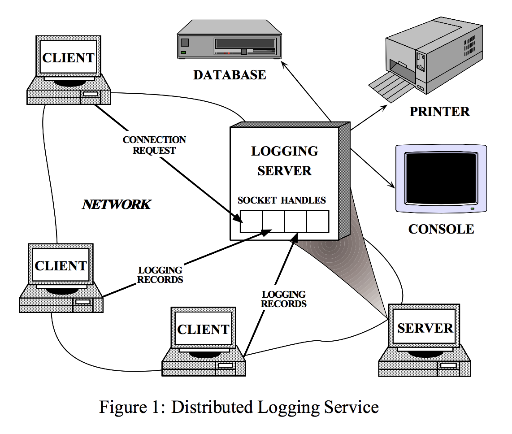

# Reactor模式

学习Java NIO和netty时，网上很多文章都会讲解Reactor 模式，刚开始总是一知半解，所以在此总结了一下对Reactor的模式的理解。

## 什么是Reactor模式？

先看看wikipedia给的定义：

```text
The reactor design pattern is an event handling pattern for handling service requests delivered concurrently to a service handler by one or more inputs. The service handler then demultiplexes the incoming requests and dispatches them synchronously to the associated request handlers.
```

翻译一下：

```text
reactor 设计模式是一个事件处理模式，用于处理由一个或多个输入并发发送给服务处理程序的服务请求。然后，服务处理程序将传入的请求进行分解，并将它们同步地分派给相关的请求处理程序。
```

从上面的定义我们知道Reactor是基于事件的处理模式，它应该至少包含一下几个部分：一个或多个输入(input)、服务处理程序(service handler)、请求出来程序(request handler)。


处理流程大致如图下所示：


所以大致流程应该是：一个或多个input是事件源，由Service Handler监听，然后它将这些事件或者叫输入同步分派给多个Request Handler。

看一篇学术论文怎么讲解reactor的 [Reactor An Object Behavioral Pattern for Demultiplexing and Dispatching Handles for Synchronous Events](./doc/reactor-siemens.pdf)。

它给reactor的定义是：用于同步事件的多路复用和分派句柄的对象行为模式。

reactor模式的目的是：

```text
The Reactor design pattern handles service requests that are delivered concurrently to an application by one or more clients. Each service in an application may consist of serveral methods and is represented by a separate event handler that is responsible for dispatching service-specific requests. Dispatching of event handlers is performed by an initiation dispatcher, which manages the registered event handlers. Demultiplexing of service requests is performed by a synchronous event demultiplexer
```
翻译下：

```text
Reactor设计模式处理有一个或多个客户端并发发送到应用程序的服务请求。应用程序的每个服务可能有多个方法组成，有一个单独的事件处理器表示，这个事件处理器负责分发特定服务的请求。事件处理器的分发由初始化分发器(initiation dispatcher)来执行，初始化分发器会管理注册的事件处理器。服务请求的分发由同步事件分离器(synchronous event demultiplexer)来执行。
```

## 实例
我们来看下上面的学术论文提到的一个实例，使用它来分析reactor的原理及其优势。



这是一个日志中心的例子。客户端会把日志记录发送到日志服务器，日志服务器需要接受这些日志记录，并把他们写入到一个或多个设备。

在本例中，日志服务器需要处理来自客户端的日志记录以及连接请求。日志记录和连接请求会通过handle并发到达。handle唯一标识了一个有操作系统管理的网络通信资源。

日志服务需要依托于面向连接的协议，比如TCP，才能和客户端通信。客户端如果想发送消息到服务端，必须先与服务端建立连接。服务端会使用handle工厂来等待客户端的连接。当客户端连接请求到达，handle工厂会创建一个与客户端的连接，并且服务端会创建一个新的handle来代表这个连接。然后服务端会使用这个handle来等待客户端请求的到来。客户端一旦连接成功，就可以并发的向服务端发送请求。服务端会通过这个连接的socket handle接收到客户端发送的数据。


开发日志服务最容易想到的方式就是使用多个线程并发的处理多个客户端，如上图所示。这种方式同步的等待连接，然后通过***一个连接一个线程***的方式来处理客户端发来的数据。

但是使用多线程的方式无法解决以下问题：
1. ***效率***：线程会导致更低的性能，由于上下文的切换、同步、以及数据的copy。
2. ***编程的简单性***：线程需要复杂的并发控制。
3. ***可移植性***：线程不是在所有操作系统上都可用。

上面几个问题是论文中提到的。
对于效率问题，我比较认同，如果应用启动非常多的线程，将会造成更多的上线文切换，平白浪费了CPU资源；多线程编程也需要我们保护共享资源，所以我们要正确的使用同步保证数据的正确性；由于每个线程都会有自己的工作内存，它会从主内存copy数据，太多的线程也会造成内存资源的浪费。
不过对于编程的简单性和可移植性，我不敢苟同。java的多线程模型已被大多数人所接受，编程的复杂度也相当低了；至于可移植性，随着硬件技术和操作系统的发展，线程已在绝大多数平台上实现了，甚至超线程技术也已经很普及了。


## Reactor模式的角色构成(Reactor模式一共有5种角色构成)：

1. Handle (句柄或是文件描述符)：本质上表示一种资源，是由操作系统提供的；该资源用于表示一个个的事件，比如说文件描述符，或是针对网络编程中的Socket描述符。事件既可以来自外部，也可以来自于内部；外部事件比如说客户端的连接请求，客户端发送过来数据等；内部事件比如说操作系统产生的定时器事件等。它本质上就是一个文件描述符。Handle是事件产生的发源地。
2. Synchronous Event Demultiplexer(同步事件分离器)：它本身是一个系统调用，用于等待事件的发生(事件可能是一个，也可能是多个)。调用方在调用它的时候会被阻塞，一直阻塞到同步事件分离器上有事件产生为止。对于Linux来说，同步事件分离器指的就是常用的I/O多路复用机制，比如说select、poll、epool等。在Java NIO领域中，同步事件分离器对应的组件就是Selector；对应的阻塞方法就是select方法。
3. Event Handler(事件处理器)：本身由多个回调方法构成，这些回调方法构成了应用相关的对于某个事件的反馈机制。Netty相比于Java NIO来说，在事件处理器这个角色上进行了一个升级，它为我们开发者提供了大量的回调方法，供我们在特定事件产生时实现相应的回调方法进行业务逻辑处理。
4. Concrete Even Handler(具体事件处理器)：是事件处理器的实现。它本身实现了事件处理器所提供的各个回调方法，从而实现了特定于业务的逻辑。它本质上就是我们所编写的一个个处理器实现。
5. Initiation Dispatcher(初始分发器)：实际上就是Reactor角色。它本身定义了一些规范，这些规范用于控制事件的调度方式，同时又提供了应用进行事件处理器的注册、删除等设施。它本身是整个事件处理器的核心所在，Initiation Dispatcher会通过同步事件分离器来等待事件的发生。一旦事件发生，Initiation Dispatcher首先会分离出每一个事件，然后调用事件处理器，最后调用相关的回调方法来处理这些事件。

## Reactor模式的流程

1. 当应用向Initiation Dispatcher注册具体的事件处理器时，应用会标识出该事件处理器希望Initiation Dispatcher在某个事件发生时向其通知的该事件，该事件与Handle关联
2. Initiation Dispatcher会要求每个事件处理器向其传递内部的Handle。该Handle就向操作系统标识了事件处理器。
3. 当所有的事件处理器注册完毕后，应用会调用handle_event方法来启动Initiation Dispatcher的事件循环。这时，Initiation Dispatcher 会将每个注册的事件管理器的Handle合并起来，并使用同步事件分离器等待这些事件的发生。比如说，TCP协议层会使用select同步事件分离器来等待客户端发送的数据到达连接的socket handle上。
4. 当与某个事件源对应的Handle变为ready状态时(比如说，TCP socket变为等待读状态时)，同步事件分离器就会通知Initiation Dispatcher。
5. Initiation Dispatcher会触发事件处理器的回调方法，从而响应这个处于ready状态的Handle。当事件发生时，Initiation Dispatcher会将被事件源激活的Handle作为「key」来寻找并分发恰当的事件处理器回调方法。
6. Initiation Dispatcher会回调事件处理器的handle_event回调方法来执行特定于应用的功能(开发者自己所编写的功能)，从而响应这个事件。所发生的事件类型可以作为该方法的参数并被该方法内部使用来执行额外的特定于服务的分离与分发。