# netty 源码分析

[上次](./netty之NioEventLoopGroup的构建.md)分析了NioEventLoopGroup的构建过程，本节将依然沿用上次的例子分析下ServerBootstrap的初始化过程。

## ServerBootstrap

ServerBootstrap的无参构造方法没有做任何事，不在赘述。下面分析下它的几个方法，首先看group方法：

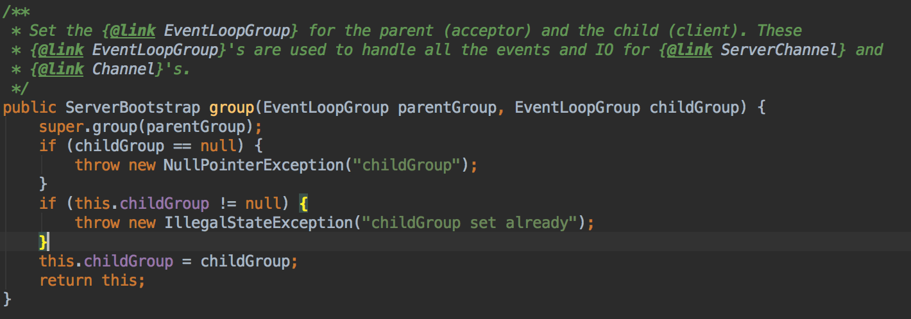

这个方法首先调用了父类(AbstractBootstrap)的group方法，看下：

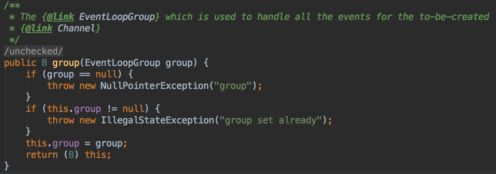

可以看到parentGroup也就是我们命名的bossGroup被设置给了AbstractBootstrap的成员变量，返回的B其实是继承了AbstractBootstrap的子类也就是ServerBootstrap。

同样childGroup也就是我们命名的workerGroup设置给了ServerBootstrap的成员变量childGroup。继续看下一个方法channel()

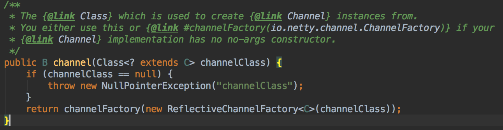

channel()方法是在AbstractBootstrap中定义的，它的javadoc说：传入的channelClass(我们传入的是NioServerSocketChannel.class)是用来创建Channel实例的。你可以选择使用本方法，或者如果Channel的实现没有无参的构造方法，则调用channelFactory(io.netty.channel.ChannelFactory)。其实本方法也是在调用channelFactory(io.netty.channel.ChannelFactory)的方法，默认传入的io.netty.channel.ChannelFactory是io.netty.channel.ReflectiveChannelFactory。ReflectiveChannelFactory其实是利用反射调用无参的构造方法创建Channel实例，我们看下ReflectiveChannelFactory的定义：

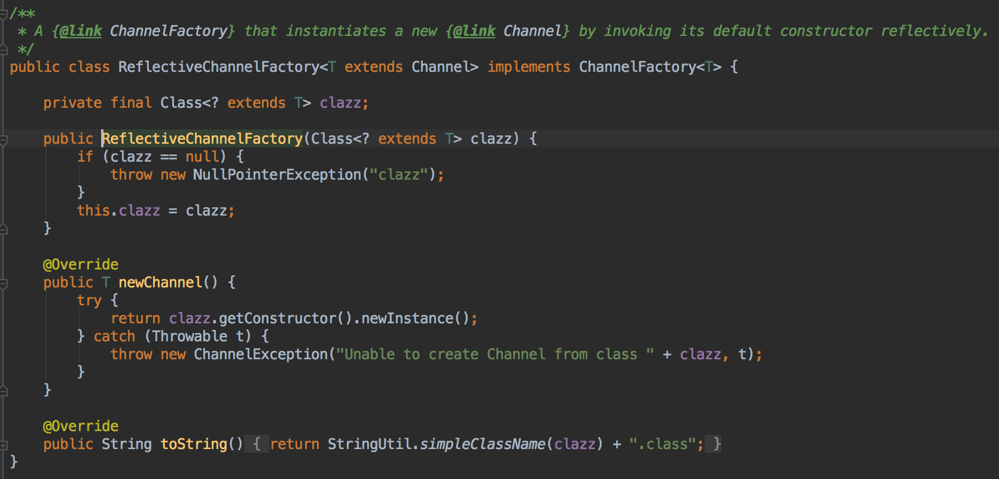

ReflectiveChannelFactory实现了ChannelFactory接口，见名知意ChannelFactory是创建Channel的工厂类，比较简单只定义了一个newChannel()方法，这里不再详述。ReflectiveChannelFactory实现了newChannel()方法，它是通过反射创建传入的class对象的实例，本例中是创建NioServerSocketChannel对象。

再来看channelFactory()方法：

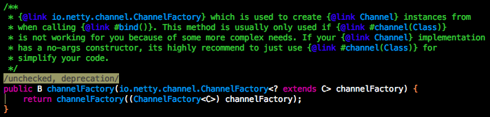

翻译一下javadoc：当调用bind()方法时，io.netty.channel.ChannelFactory被用来创建Channel的实例。这个方法通常在由于复杂的需求导致channel(Class)方法不再适用时才会被使用。如果你的Channel实现拥有无参的构造方法，强烈推荐使用channel(Class)来简化你的代码。

这个方法的javadoc给出了我们两个信息：
1. Channel的创建是在bind()方法调用时。
2. 如果Channel的实现类拥有无参的构造方法，那么推荐使用channel(Class)方法，而不是本方法。

这个方法调用了重载的方法，所以继续跟下去：

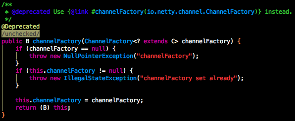

注意这里的入参是io.netty.bootstrap.ChannelFactory <? extends C> channelFactory，上面的入参io.netty.channel.ChannelFactory<? extends C> channelFactory，其中io.netty.channel.ChannelFactory是io.netty.bootstrap.ChannelFactory的子接口。

这个方法所做的就是将传入的channelFacctory负值给成员变量，在bind方法调用时，使用该变量创建Channel对象。

channel()方法到此分析结束，它所做的工作就是用过传入的Channel Class，创建一个ChannelFactory赋值给AbstractBootstrap的成员变量private volatile ChannelFactory<? extends C> channelFactory，在调用bind()方法是通过该变量创建Channel对象。下面分析下handler和childHandler方法：

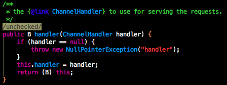

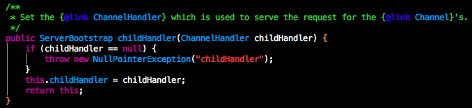

handler位于AbstractBootstrap类中，childHandler位于ServerBootstrap类中；handler用于处理请求作用于bossGroup，childHandler用于任务处理作用于workerGroup。这两个方法只是简单的成员变量负值。

下面分析bind()方法的实现：

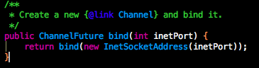

bind()方法接受一个int类型的端口号，返回一个 [ChannelFuture](./netty之ChannelFuture.md)。它调用了重载的方法，传入了通过port创建的InetSocketAddress。看下重载方法：

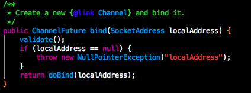

这个方法首先校验group和channelFactory成员变量，确保他们非空，然后真正执行绑定操作(doBind)。

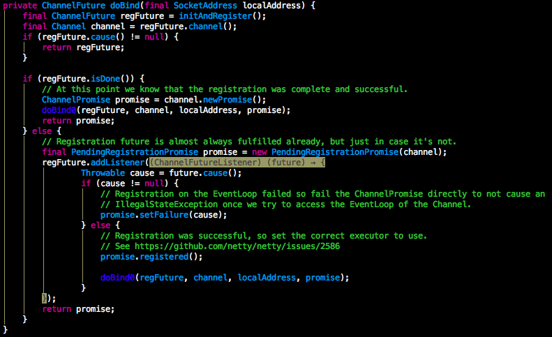

doBind方法首先调用initAndRegister方法初始化并注册了一个Channel，看initAndRegister的实现：

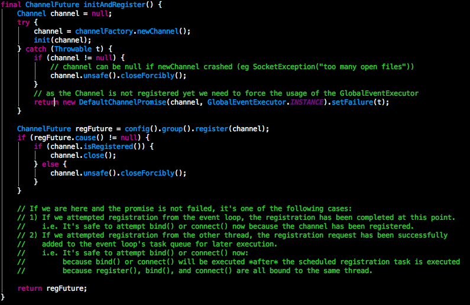

initAndRegister这个方法首先通过channelFactory方法创建了一个Channel，然后通过init()方法对Channel进行初始化。init()方法是一个模板方法，在AbstractBootstrap定义，我们直接看ServerBootstrap的实现：

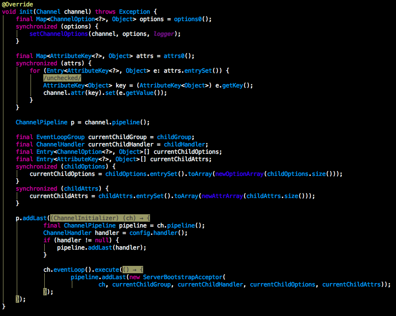

init()方法首先为Channel设置选项(options)，然后为Channel设置属性(attr)，最后获取与Channel绑定的ChannelPipeline，并为该ChannelPipeline设置自定义的ChannelInitializer，当NioServerSocketChannel在EventLoop注册成功时，该ChannelInitializer的initChannel方法将被调用，initChannel先设置用户配置的hanlder，然后在事件循环中为pipeline添加ServerBootstrapAcceptor，该Handler主要用来将新创建的NioSocketChannel注册到EventLoopGroup中。

接下来执行ChannelFuture regFuture = config().group().register(channel)，config().group()其实返回的是bossGroup实例，然后调用的它的register方法，register的具体实现在MultithreadEventLoopGroup中：

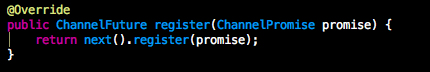

首先使用next()在BOSS EventLoopGroup中选出下一个EventLoop，然后执行注册。

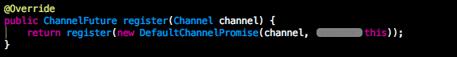

上面的注册方法在SingleThreadEventLoop中，然后是看下重载的方法：

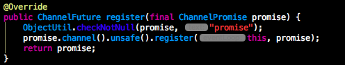

promise.channel().unsafe()返回io.netty.channel.Channel.Unsafe，这个类是netty内部使用的，不建议外部调用。

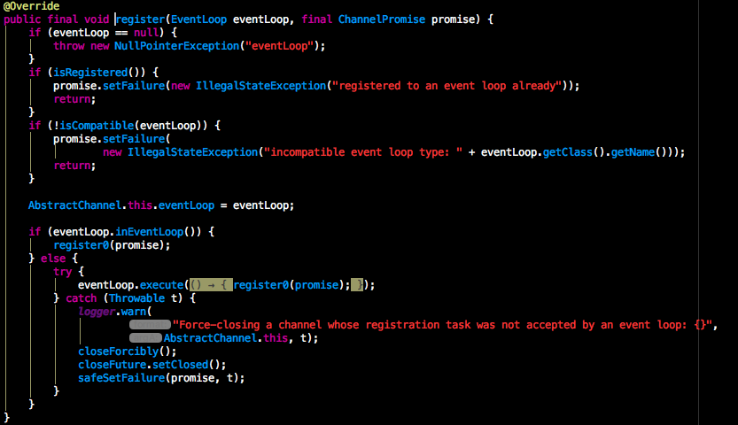

该方法首先获取到与Channel绑定的EventLoop，然后判断是否是当前EventLoop发起的，如果是直接在本线程执行，如果不是，则封装成Task由该EventLoop执行。接着看register0()方法：

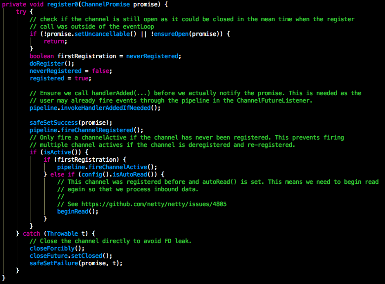

doRegister()是完成真正的注册操作，这个是个多态方法，定义在AbstractChannel，本文示例中的实现在AbstractNioChannel

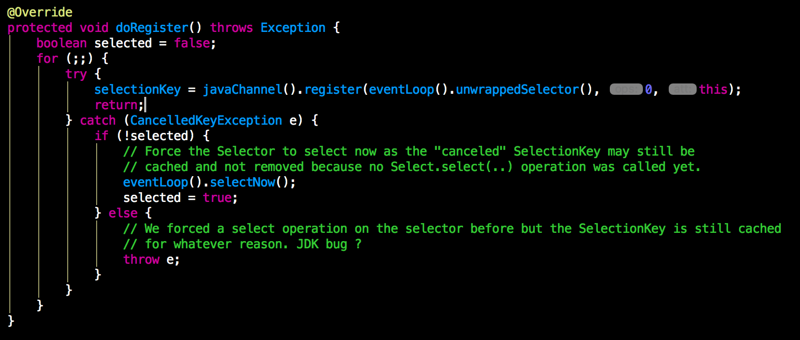

doRegister()的ops设置为0，所以还不能监听网络读写。然后调用了pipeline.invokeHandlerAddedIfNeeded()；这里是调用Handler的handlerAdded()方法，如何实现的等分析pipeline时在细说。然后safeSetSuccess(promise);将注册设为成功，并调用pipeline.fireChannelRegistered();这里会调用Handler的channelRegistered()方法。执行完initAndRegister()方法，开始执行：doBind0()

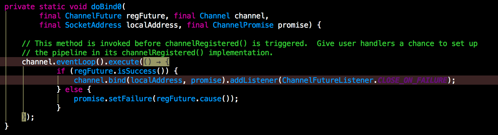

这个方法会将绑定操作放入执行队列，然后调用Channel(实际是AbstractChannel)的bind()方法：

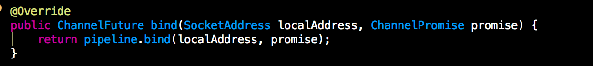

然后调用pipeline(DefaultChannelPipeline)的bind()方法：

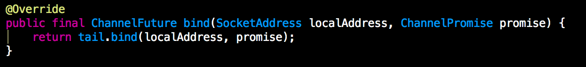

然后调用AbstractChannelHandlerContext的bind()方法：

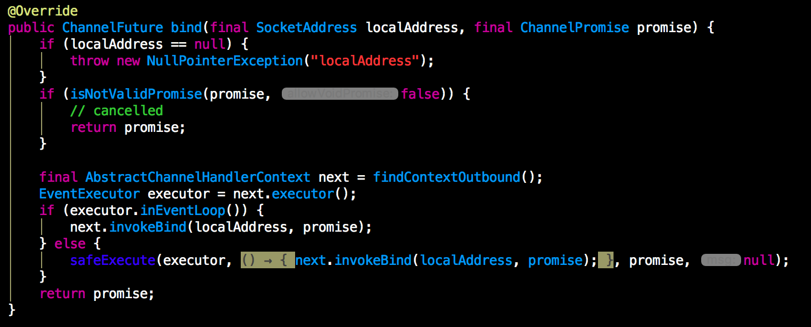

然后调用AbstractChannelHandlerContext的invokeBind()方法：

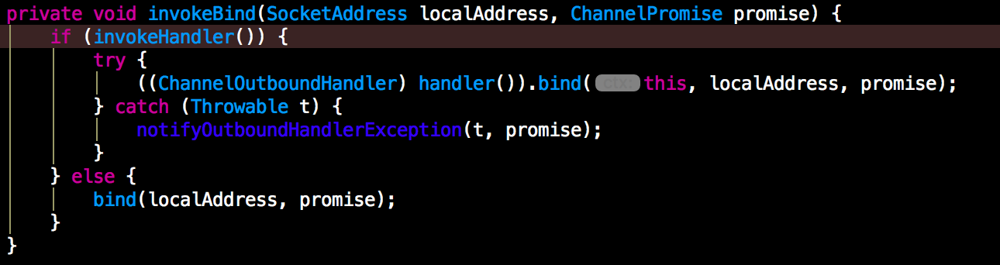

然后调用DefaultChannelPipeline.HeadContext的bind方法：

接着调用AbstractChannel.AbstractUnsafe的bind()方法：

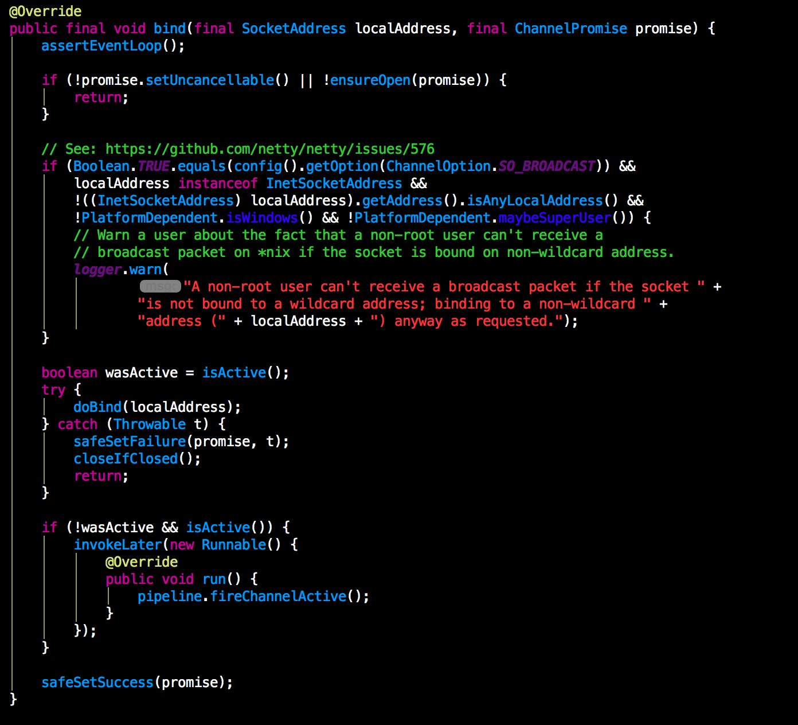

这个方法主要做三件事：

1. 调用doBind()执行java原生socket绑定
2. 通过pipeline.fireChannelActive()触发Handler的channelActive()方法
3. 设置ChannelPromise为成功

看下doBind()方法(这个方法是NioServerSocketChannel中的)：

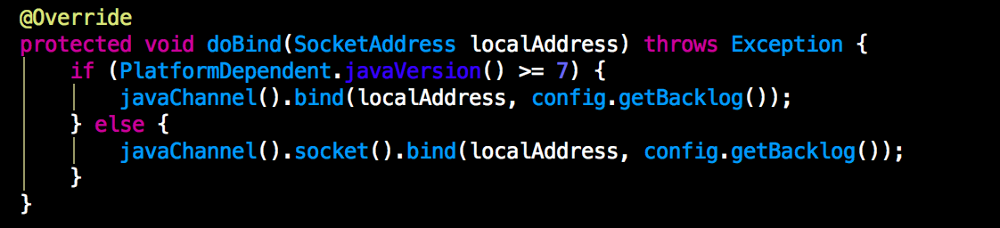

这里根据java的版本分别调用了不同的jdk绑定方法。

至此netty的绑定流程就分析完毕了。
