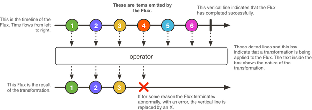

# 响应式编程-Reactor核心特性之Flux

Flux<T>是标准的Publisher<T>，它代表一个异步的能够产生0..n个元素的序列，它可以被一个完成或者错误信号终结。因此，flux可能包含的所有元素可以是一个值、一个完成信号或者是一个错误。正如在Reactive Streams规范中所说的，这三种信号类型会转化为对下游对象的onNext、onComplete或者onError方法的调用。

有了这几个信号，Flux就是一个通用的响应式类型。注意：所有的事件，设置终止操作，都是可选的：没有onNext事件但是有onComplete事件表示空的有限序列，但是如果没有onComplete事件表示空的无限序列。同样，无限序列也不一定是空的。比如，Flux.interval(Duration) 会产生Flux<Long>，它是一个无限序列并且会周期性的产生元素。