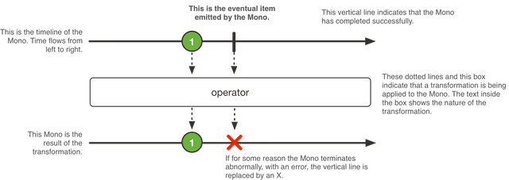

# 响应式编程-Reactor核心特性之Mono

`Mono<T>` 是特殊的发布者(`Publisher<T>` )，它只会发布最多一个元素，可以被onComplete信号或者onError信号中断。

它只提供Flux可用的操作符的一个子集。例如，例如，组合操作符可以忽略右边的排放并返回另一个Mono，也可以从两边发出值。在后一种情况下，它们变成了Flux。

举个例子，Mono#concatWith(Publisher)返回Flux，而Mono#then(Mono)返回另一个Mone。

注意，Mono可以用来表示没有值的异步操作，这个操作只有完成的概念(比如Runnable)。可以使用Mono<Void>来创建。